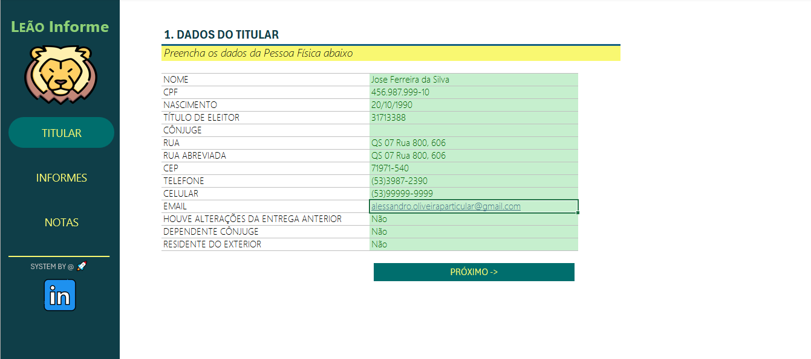
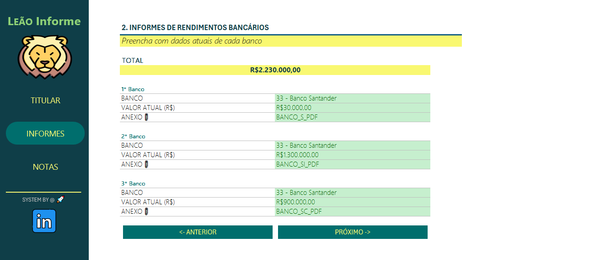
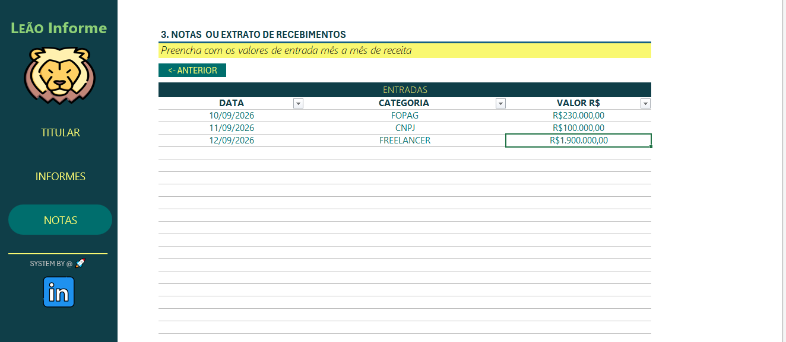

## Organizador de Declaração de Imposto de Renda

Projeto desenvolvido em Excel como parte de um desafio da DIO, com o objetivo de organizar e centralizar informações e documentos necessários para a preparação da Declaração de Imposto de Renda Pessoa Física (IRPF).

## Objetivo

Facilitar a organização das informações necessárias para a preparação da declaração anual do Imposto de Renda, reunindo dados pessoais, informações bancárias e registros de recebimentos em um único arquivo.

## Funcionalidades

A planilha foi desenvolvida com recursos de automação e navegação para facilitar o preenchimento e a organização das informações.

Entre as principais funcionalidades estão:

- Navegação entre as diferentes abas da planilha;
- Botão **Anterior** para retornar à etapa anterior;
- Botão **Próximo** para avançar entre as etapas;
- Organização das informações em diferentes etapas;
- Recursos de validação para auxiliar no preenchimento;
- Tabela de referência de instituições financeiras;
- Centralização das informações necessárias para a preparação da declaração.

## Estrutura do Arquivo

### 1. Dados do Titular

Área destinada ao preenchimento das informações pessoais do titular, como:

- Nome completo;
- CPF;
- Data de nascimento;
- Título de eleitor;
- Endereço;
- CEP;
- Telefone, celular e e-mail;
- Informações relacionadas à declaração anterior;
- Dependentes;
- Residência no exterior.

### 2. Informes de Rendimentos Bancários

Área destinada à organização das informações das instituições financeiras utilizadas, permitindo registrar:

- Instituição financeira;
- Valores informados;
- Informações relacionadas aos informes de rendimentos;
- Referência aos documentos e comprovantes.

### 3. Notas ou Extrato de Recebimentos

Área destinada ao registro das entradas de receitas ao longo do ano, permitindo organizar:

- Recebimentos mês a mês;
- Categoria do recebimento;
- Origem da receita;
- Valores correspondentes.

### 4. Tabela de Bancos

Tabela de referência contendo códigos e nomes de instituições financeiras para auxiliar no preenchimento das informações bancárias.

## Tecnologias e Recursos

- Microsoft Excel;
- Fórmulas e recursos de validação;
- Navegação entre abas;
- Links internos;
- Botões de navegação;
- Organização e estruturação de dados.

## Como Utilizar

1. Baixe o arquivo Excel disponível neste repositório.
2. Abra a planilha no Microsoft Excel.
3. Inicie o preenchimento pela etapa de **Dados do Titular**.
4. Utilize os botões **Próximo** e **Anterior** para navegar entre as etapas.
5. Preencha as informações bancárias e os registros de recebimentos.
6. Utilize a tabela de bancos como referência quando necessário.

## Observações

- O projeto tem finalidade de **organização e centralização de informações**.
- A planilha não substitui o programa ou sistema oficial da Receita Federal para a transmissão da declaração.
- Recomenda-se manter os documentos e comprovantes correspondentes às informações registradas.
- O projeto foi desenvolvido para fins de aprendizado e como parte do desafio da DIO.

## Páginas

### Dados do Titular

### Informes de Rendimentos Bancários

### Notas ou Extrato de Recebimentos

## Projeto

Autor
Alessandro Oliveira
Desafio prático da DIO - Santander- Excel com IA e Claude — Setembro/2026

